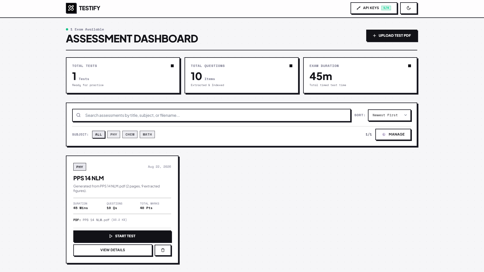

# Testify
Deliberate misnomer cuz why not 😝

Testify is an app I built primarily for myself (but I decided to share it with everyone anyway of course haha) for the purpose of converting PDF assignments that I get from my coaching center into these CBT (Computer Based Test)-style tests that I can give.

I was mostly bored, and I thought this would be a cool idea and I wanted this for myself in order to not just be able to solve these assignments in the same style, but also to have this record of everything kept neatly on my machine, so I made it!

It's completely local-first as it is right now, completely free, it runs on your own machine and your data is kept on your own machine, it never leaves, and you bring your own API keys from your favourite providers in order to get it to work.